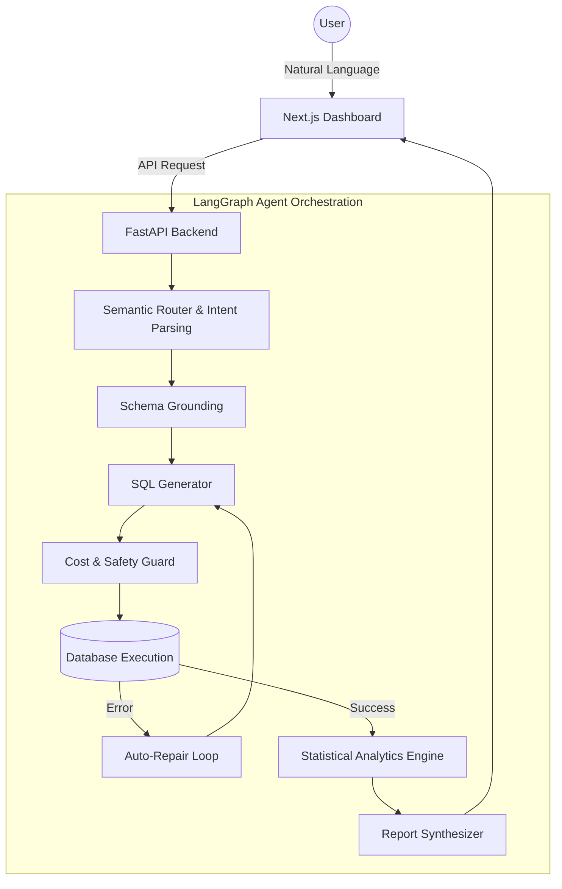

<div align="center">
  
  
  
  
  
  <br/>
  
  # 📊 Database Agent AI
  
  **Your Intelligent Database Analyst — Ask Questions, Get Deep Insights.**
  
  [](https://www.python.org/)
  [](https://fastapi.tiangolo.com/)
  [](https://nextjs.org/)
  [](https://www.langchain.com/)
  [](https://www.docker.com/)

  *Talk to your SQL database in English or Arabic (RTL Supported), and receive ChatGPT-like analytical reports, visually stunning Markdown tables, and smart charts.*
</div>

---

## 🌟 Why Database Agent AI?

Writing SQL queries is slow, and raw data grids are hard to interpret for decision-makers. 
**Database Agent AI** transforms your database into a conversational partner. Powered by a **FastAPI + LangGraph** backend and a beautiful **Next.js** dashboard, it translates natural language into safe SQL, executes it, and synthesizes the results into a **deeply analytical, executive-ready report**.

- **Not just a query generator:** It acts like a Senior Data Analyst, explaining the *why* and *what it means* behind the numbers.
- **Database-agnostic:** Works out-of-the-box with **PostgreSQL, MySQL, MariaDB, and SQLite**.
- **Fully localized:** Flawless support for Arabic (including regional dialects) and Right-To-Left (RTL) formatting.

---

## 🚀 Key Features

### 🧠 ChatGPT-Style Deep Analytics
Instead of returning a raw data grid, the Agent synthesizes a comprehensive narrative. It highlights trends, spots anomalies, and logically handles edge cases (e.g., understanding that a query for the year 2029 will naturally return empty because it's in the future, not due to "business slump").

### 💬 Native Arabic & RTL Support
Native support for Right-To-Left (RTL) interfaces. Beautifully styled Markdown tables are dynamically parsed to ensure data looks perfect regardless of language direction.

### 🛡️ Safety-First Execution Environment
- **Read-Only Enforcement:** AST-level SQL validation (`sqlglot`) prevents any DROP, DELETE, or UPDATE commands.
- **Cost Guard:** Auto-enforced `LIMIT` clauses and full-table scan preventions.
- **Data Masking:** Optional masking of PII (Personally Identifiable Information).

### 📈 Smart Data Visualization
Automatically detects data types and suggests the perfect chart (Line, Bar, Scatter) to visualize the results without requiring additional prompts.

### 🧠 Advanced LangGraph Architecture
Employs a multi-step **Plan-and-Execute** flow. If a generated query fails, the agent auto-repairs it using self-consistency loops and syntax error feedback.

---

## 🏗️ System Architecture



---

## 🛠️ Technology Stack

| Component | Technology |
|---|---|
| **Backend API** | FastAPI, Uvicorn, pydantic-settings |
| **Agent Orchestration** | LangChain, LangGraph |
| **LLM Providers** | OpenAI, OpenRouter, Groq, Ollama (Local) |
| **SQL Engine** | SQLAlchemy 2.x, sqlglot, sqlparse |
| **Frontend** | Next.js 16, React 19, TypeScript, Tailwind CSS, shadcn/ui, Zustand, Recharts |
| **Testing & CI** | pytest, pytest-asyncio |

---

## 🚦 Getting Started

### Prerequisites
- Node.js 18+ and `npm`
- Python 3.12+ (using `uv` is highly recommended)
- An API key for an LLM provider (OpenAI, OpenRouter, Groq) OR a local Ollama instance.

### 🐳 Option 1: Docker Compose (Recommended)

The fastest way to get started is by spinning up the entire stack using Docker.

```bash
cp backend/.env.example backend/.env
# Edit backend/.env and add your LLM API keys

docker compose up --build
```
- **Dashboard:** http://localhost:3000
- **API Docs:** http://localhost:8000/docs

### 💻 Option 2: Local Development

**1. Start the Backend:**
```bash
cd backend
cp .env.example .env
# Edit your .env file
uv sync
uvicorn app.main:app --reload --host 0.0.0.0 --port 8000
```

**2. Start the Frontend:**
```bash
cd frontend
npm install
NEXT_PUBLIC_API_URL=http://localhost:8000 npm run dev
```

*Note: The backend ships with a sample SQLite database (`chinook.db`) so you can test the system immediately without connecting a live database.*

---

## ⚙️ Configuration

The system is highly configurable via environment variables (see `backend/.env.example`). Key configurations include:

- **LLM Settings:** `LLM_PROVIDER`, `OPENAI_API_KEY`, `GROQ_API_KEY`
- **Memory:** `MEMORY_WINDOW_SIZE` (Controls conversational context length)
- **Safety Knobs:** `ENABLE_COST_GUARD`, `ENABLE_DATA_MASKING`
- **Agent Behavior:** `ENABLE_SELF_CONSISTENCY` (Votes across multiple LLM outputs for highest accuracy)

---

## 🔌 Connecting Your Database

The agent natively supports dynamic connection swapping without restarting the server. You can connect your database directly from the Next.js UI or via REST API:

- **PostgreSQL / MySQL:** Provide your standard connection URI.
- **SQLite:** Upload your `.db` or `.sqlite` file directly through the portal.

*Connections are encrypted at rest.*

---

## 🧪 Testing

The backend includes a comprehensive, 130+ unit & integration test suite covering the AST validator, memory TTLs, and the LangGraph orchestrator.

```bash
cd backend
pytest tests/
```

---

## 🔒 Security Notice

- **Single-User Design:** This application is built as a local, single-user analytical tool. It is **NOT** intended to be deployed on the public internet without implementing robust authentication (e.g., OAuth, JWT).
- **Credentials:** Ensure `backend/.env` is never committed. 

---

<div align="center">
  <i>Built with ❤️ using AI. Licensed under MIT.</i>
</div>
